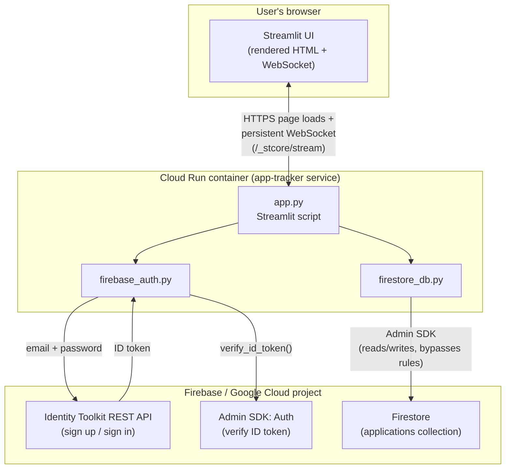
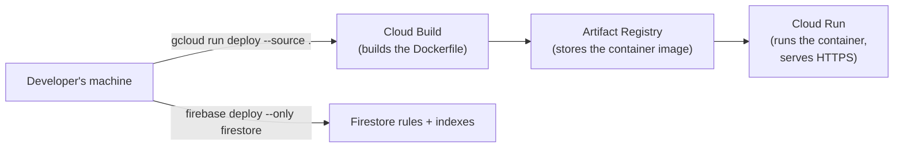

# Architecture

This document explains how the pieces of Application Tracker fit
together, and *why* they're arranged this way. If a term here is
unfamiliar, check the [glossary](glossary.md) first.

## The one-sentence version

A single Python (Streamlit) server runs in a Docker container on Cloud
Run; it's the *only* thing that ever talks to Firebase — the user's
browser only ever talks to that one server.

This is unusual compared to most Firebase tutorials, which have the
*browser* talk to Firebase directly using JavaScript. This app can't do
that, because Streamlit doesn't give you a way to run your own custom
JavaScript in the browser — see
[ADR 0001](adr/0001-use-streamlit-for-the-ui.md) and
[ADR 0002](adr/0002-auth-via-rest-api-not-web-sdk.md) for why that
constraint shaped everything else.

## Diagram

## Walking through it

### 1. The browser talks only to the Streamlit server

When you open the app's URL, your browser loads the Streamlit frontend
(static JS/CSS Streamlit ships) and opens a WebSocket back to the same
server at `/_stcore/stream`. Every click, form submission, or dropdown
change gets sent over that WebSocket; the server re-runs
[`app.py`](modules/app.py.md) top-to-bottom and sends back the updated
UI. The browser never has direct network access to Firebase at all.

This has one important consequence covered in its own ADR: because a
user's whole session lives in the memory of *one specific server
process*, that process must keep receiving that user's traffic for the
session to keep working — see
[ADR 0005](adr/0005-cloud-run-session-affinity.md).

### 2. Logging in: browser → Streamlit → Identity Toolkit → Streamlit

1. You submit the login form in your browser.
2. That's sent to the Streamlit server as a normal Streamlit interaction
   (over the WebSocket).
3. [`app.py`](modules/app.py.md) calls
   `firebase_auth.sign_in(email, password)`.
4. [`firebase_auth.py`](modules/firebase_auth.py.md) makes an HTTPS
   `POST` request, *from the server*, to Google's Identity Toolkit REST
   API, with your email/password.
5. Identity Toolkit checks your credentials and, if correct, returns an
   **ID token** (and other data).
6. Before trusting anything in that response, `firebase_auth.py`
   re-verifies the ID token using the Admin SDK
   (`admin_auth.verify_id_token`) — this cryptographically confirms the
   token is genuinely signed by Firebase for this project, rather than
   just trusting whatever the REST call claims.
7. The verified `uid` and email are stored in `st.session_state.session`
   — Streamlit's per-browser-tab memory — and the page re-renders as the
   logged-in dashboard.

### 3. Using the dashboard: browser → Streamlit → Firestore (via Admin SDK)

Every dashboard action (loading your applications, adding one, moving
its status, deleting it) follows the same shape:

1. Browser interaction → sent to the Streamlit server over the
   WebSocket.
2. `app.py` calls a function in
   [`firestore_db.py`](modules/firestore_db.py.md), always passing the
   signed-in user's `uid`.
3. `firestore_db.py` uses the **Admin SDK** to read/write Firestore.
   The Admin SDK runs with full trust (it's meant for servers, not
   browsers) and *ignores* Firestore's normal security rules entirely.
4. Because the Admin SDK doesn't enforce per-user access on its own,
   every function in `firestore_db.py` does it manually — filtering
   reads by `uid`, and checking `data.get("uid") != uid` before allowing
   an update or delete.

This means the **real access-control boundary for this app is the
Python code in `firestore_db.py`**, not Firestore's security rules. The
rules file exists as a backstop that denies *any* other path into the
database — see
[ADR 0003](adr/0003-admin-sdk-server-side-with-deny-all-rules.md) for
the full reasoning.

### 4. Deployment shape

`gcloud run deploy --source .` reads the [`Dockerfile`](modules/Dockerfile.md),
builds a container image via Cloud Build, pushes it to Artifact
Registry, and points the `app-tracker` Cloud Run service at the new
image — all in one command. Firestore's rules and composite indexes are
deployed separately, via the `firebase` CLI, because they're not part of
the container at all — they're configuration that lives on the Firestore
service itself.

Notably, **Firebase Hosting is not part of this picture** even though
this is a Firebase-backed app — see
[ADR 0004](adr/0004-cloud-run-direct-not-firebase-hosting.md) for why
the obvious "put Firebase Hosting in front of it" choice was reverted.

## Trust boundaries, summarized

| Boundary | Who's on each side | Enforced by |
|---|---|---|
| Browser ↔ Streamlit server | Anonymous browser / this app's server | HTTPS + Cloud Run (`--allow-unauthenticated`, so anyone can reach the login page) |
| "Is this really user X?" | Streamlit server / Firebase Auth | ID token verification (`admin_auth.verify_id_token`) |
| "Can user X see/edit this record?" | Streamlit server / Firestore | Manual `uid` checks in `firestore_db.py` (Firestore rules deny everything as a backstop) |
| Streamlit server ↔ Firestore/Auth APIs | This app's server / Google's servers | Cloud Run's attached service account (production) or a downloaded key file (local dev) |
